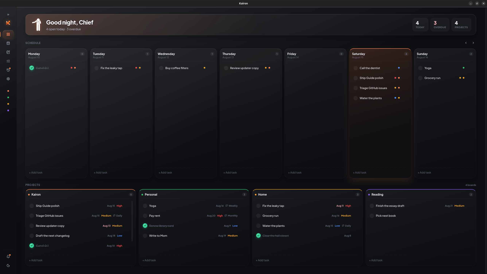

  

<h1 align="center">Kairon</h1>

  <strong>v1.1.0</strong>  local-first desktop planner 
  Tasks · Projects · Calendar · Notes

  
  
  
  

  Local-first desktop planner · tasks, projects, calendar, notes 
  Built with <a href="https://wails.io">Wails</a> (Go) + React + TypeScript. SQLite on disk.

## Vision

Planning should feel like sitting down at your own desk — not logging into someone else’s cloud.

Kairon is a quiet place for that work: tasks, projects, a calendar, and notes in one window, with the database on your machine. No account. No feed. No product that needs the network just so you can remember what you owed yourself this week.

The aim is small and stubborn. Capture quickly, see the week clearly, finish what matters, and leave the rest of the internet at the door.

  

## Download

Get the app from **[Releases](https://github.com/Lusan-sapkota/Kairon/releases)**  no need to build from source.

| OS | Asset | How to run |
|----|--------|------------|
| **Linux** (Debian/Ubuntu) | `kairon_*_amd64.deb` | `sudo apt install ./kairon_*_amd64.deb` then open **Kairon** from the app menu |
| **Linux** (any) | `kairon-linux-amd64` | `chmod +x kairon-linux-amd64 && ./kairon-linux-amd64` |
| **Windows** | `kairon-windows-amd64.exe` | Run the `.exe` |
| **macOS** | `kairon-darwin-universal.zip` | Unzip and open the `.app` |

The `.deb` installs to `/usr/bin/kairon` and depends on `libgtk-3-0` + `libwebkit2gtk-4.1-0` (Ubuntu 22.04+ / Debian 12+).

Your data stays local in SQLite (see [Data storage](#data-storage)). The in-app handbook is **Settings → Guide** (same as **[GUIDE.md](GUIDE.md)**).

## Features (summary)

| Area | Highlights |
| --- | --- |
| Capture | Composers, command palette (`Ctrl/Cmd+K`), board `+ Add task` |
| Organize | Projects, tags, priorities, due dates, recurring tasks |
| Plan | Week board + month calendar |
| Write | Markdown notes synced with task notes |
| Remind | In-app / desktop notifications, History, optional SMTP reports |
| Privacy | 100% local SQLite — backup, restore, wipe; no accounts, no sync |

## Data storage

Everything lives in `planner.db` under your OS config directory:

| OS | Path |
| --- | --- |
| Linux | `~/.config/planner/planner.db` |
| macOS | `~/Library/Application Support/planner/planner.db` |
| Windows | `%AppData%\planner\planner.db` |

Schema migrations run automatically on startup.

## Docs

| Doc | Purpose |
| --- | --- |
| [GUIDE.md](GUIDE.md) | User guide (also Settings → Guide in the app) |
| [CONTRIBUTING.md](CONTRIBUTING.md) | Dev setup, layout, PR guidelines |
| [LICENSE](LICENSE) | MIT |

## Contributing

Bug reports, ideas, and PRs welcome. See [CONTRIBUTING.md](CONTRIBUTING.md).

## License

[MIT](LICENSE) © 2026 Lusan Sapkota
