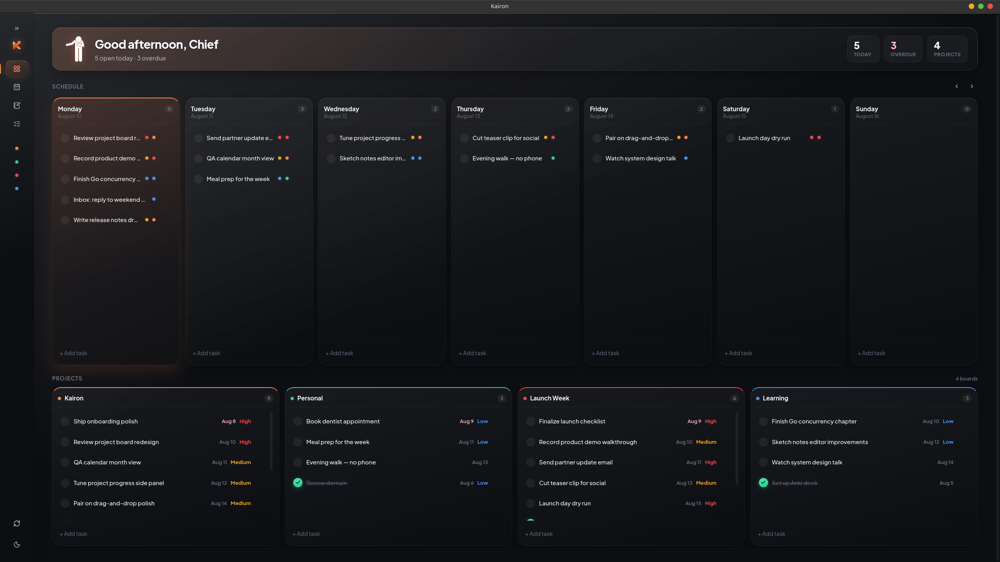
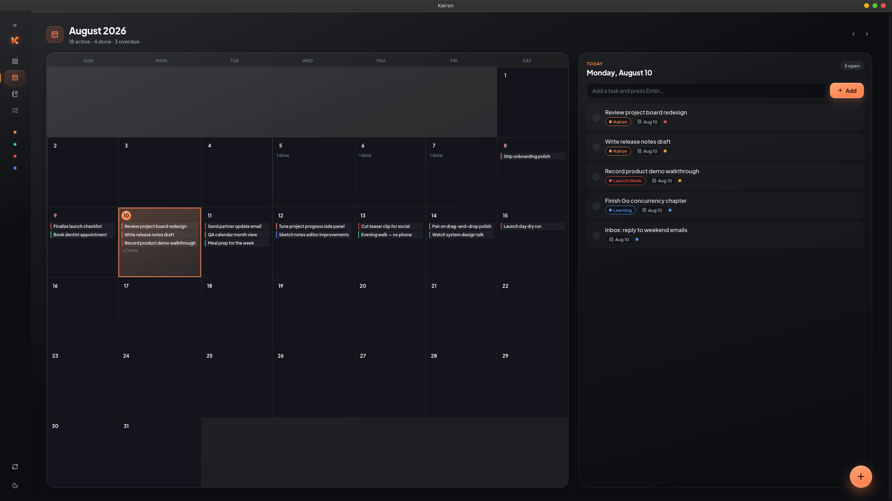
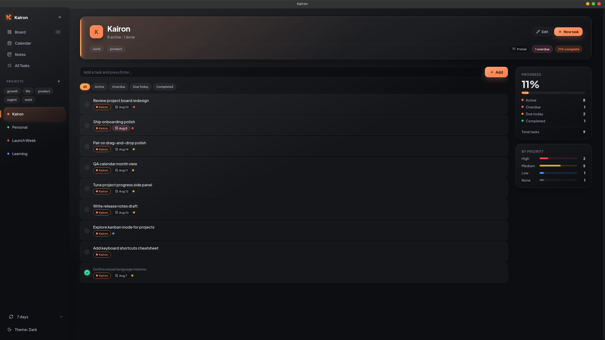
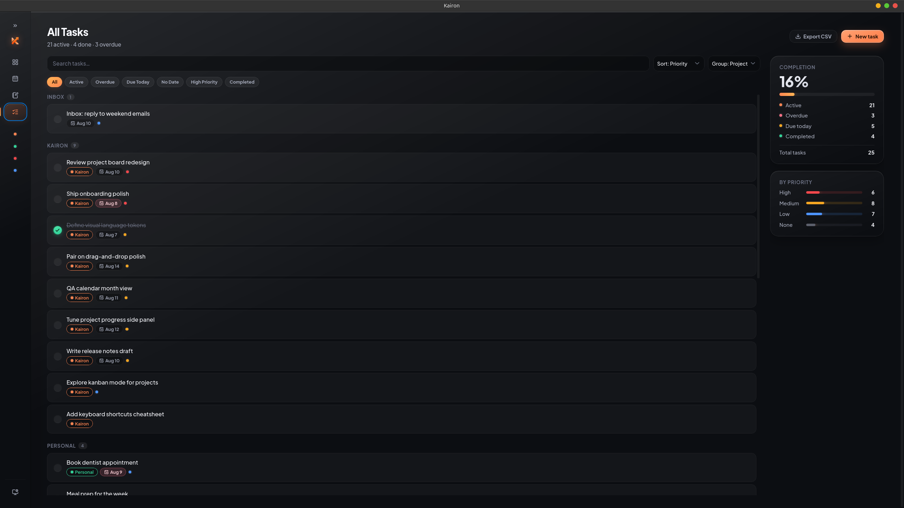
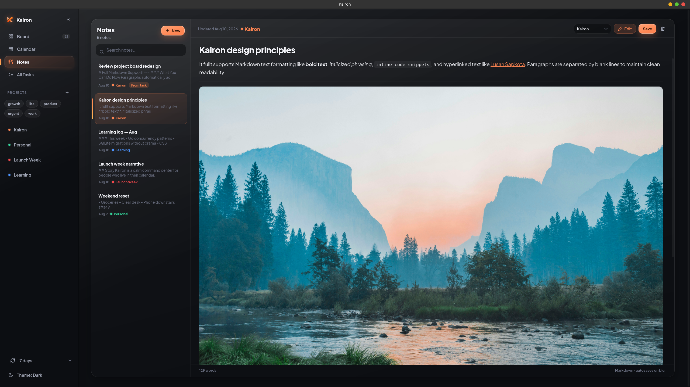
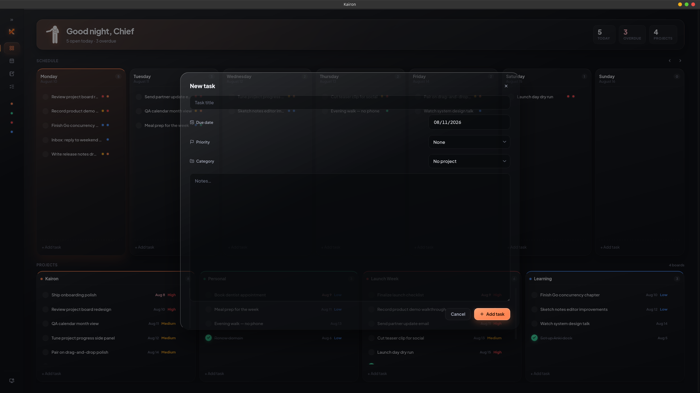
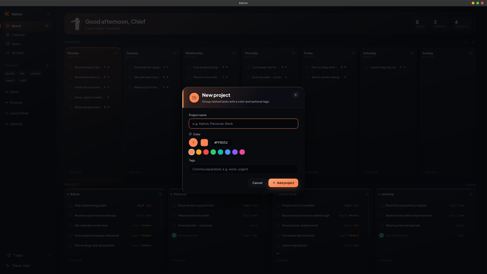
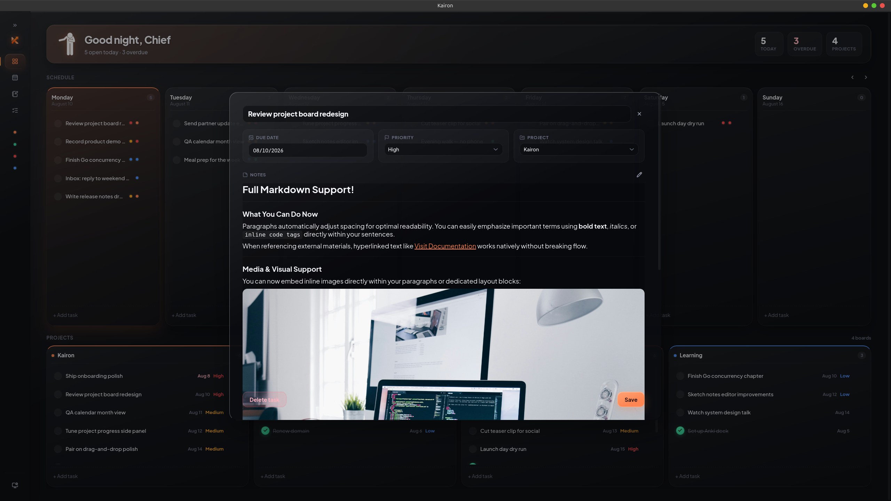

  

<h1 align="center">Kairon</h1>

  <strong>v1.0.0</strong> — local-first desktop planner 
  Tasks · Projects · Calendar · Notes

  
  
  
  

  A calm, self-contained planner for your desktop. 
  Built with <a href="https://wails.io">Wails</a> (Go) + React + TypeScript. SQLite on disk. No accounts. No network.

## Download

Get the packaged app from GitHub Releases — no need to build from source.

1. Open **[Releases](https://github.com/Lusan-sapkota/Kairon/releases)** (or jump to **[v1.0.0](https://github.com/Lusan-sapkota/Kairon/releases/tag/v1.0.0)**).
2. Under **Assets**, download the application bundle for your OS.
3. Unpack or install if needed, then run **Kairon**.

Your data stays local in SQLite (see [Data storage](#data-storage)). For clicks, drag-and-drop, and hover tooltips, see **[GUIDE.md](GUIDE.md)**.

## Screenshots

<table>
  <tr>
    <td colspan="2" align="center">
       
      <em>Board — week schedule + project columns</em>
    </td>
  </tr>
  <tr>
    <td align="center" width="50%">
       
      <em>Calendar — month grid + day agenda</em>
    </td>
    <td align="center" width="50%">
       
      <em>Project — full-width tasks + progress</em>
    </td>
  </tr>
  <tr>
    <td align="center" width="50%">
       
      <em>All Tasks — search, filters, stats</em>
    </td>
    <td align="center" width="50%">
       
      <em>Notes — search, Markdown edit &amp; preview</em>
    </td>
  </tr>
  <tr>
    <td align="center" width="50%">
       
      <em>New task modal</em>
    </td>
    <td align="center" width="50%">
       
      <em>New / edit project modal</em>
    </td>
  </tr>
  <tr>
    <td colspan="2" align="center">
       
      <em>Task detail — fields, Markdown notes, save</em>
    </td>
  </tr>
</table>

## What’s in v1.0.0

- **Board** — Monday–Sunday schedule at full width; drag tasks across days or projects; ←/→ moves one day
- **Calendar** — Month grid with task pills + day agenda and floating quick-add
- **All tasks** — Search, filters, grouping, sort, side stats, CSV export
- **Projects** — Color + tags, edit name/color/tags, progress and priority breakdown
- **Notes** — Markdown edit/preview, project link, autosave on blur
- **Polish** — Light / dark / system themes, task hover tooltips, confirm-before-delete

## Features (summary)

| Area | Highlights |
| --- | --- |
| Capture | Composers, quick-add modal, board column `+ Add task` |
| Organize | Projects, tags, priorities, due dates |
| Plan | Week board + month calendar |
| Write | Markdown notes synced with task notes |
| Privacy | 100% local SQLite — no accounts, no sync |

## Data storage

Everything lives in `planner.db` under your OS config directory:

| OS | Path |
| --- | --- |
| Linux | `~/.config/planner/planner.db` |
| macOS | `~/Library/Application Support/planner/planner.db` |
| Windows | `%AppData%\planner\planner.db` |

Schema migrations run automatically on startup.

## Docs

| Doc | Purpose |
| --- | --- |
| [GUIDE.md](GUIDE.md) | User guide — gestures, views, tooltips, tips |
| [CONTRIBUTING.md](CONTRIBUTING.md) | Dev setup, layout, PR guidelines |
| [LICENSE](LICENSE) | MIT |

## Contributing

Bug reports, ideas, and PRs welcome. See [CONTRIBUTING.md](CONTRIBUTING.md).

## License

[MIT](LICENSE) © 2026 Lusan Sapkota
